# Causing: CAUSal INterpretation using Graphs

[](https://opensource.org/licenses/MIT)
[](https://www.python.org/)

_Causing is a multivariate graphical analysis tool helping you to interpret the the causal
effects of a given equation system._

**Input:** You simply have to put in a dataset and provide an equation system in form of a
python function. The endogenous variable on the left had side are assumed being caused by
the variables on the right hand sight of the equation. Thus, you provide the causal structure
in form of an directed acyclic graph (DAG).

**Output:** As an output you will get a colored graph of quantified effects acting between
the model variables. You are able to immediately interpret mediation chains for every
individual observation - even for highly complex nonlinear systems.

Further, the method enables model validation. The effects are estimated using a structural
neural network. You can check wether your assumed model fits the data. Testing for significance
of each individual effect guides you in how to modify and further develop the model.
The method can be applied to highly latent models with many of your modeled endogenous
variables being unboserved.

Here is a table relating Causing to to other approaches:

Causing is | Causing is NOT
--- | ---
 &nbsp; causal model given |  &nbsp; causal search
 &nbsp; DAG directed acyclic graph |  &nbsp; cyclic, undirected or bidirected graph
 &nbsp; latent variables |  &nbsp; just observed / manifest variables
 &nbsp; indiviual effects |  &nbsp; just average effects
 &nbsp; direct, total and mediation effects |  &nbsp; just total effects
 &nbsp; structural model |  &nbsp; reduced model
 &nbsp; small data |  &nbsp; big data requirement
 &nbsp; supervised learning |  &nbsp; unsupervised learning
 &nbsp; model estimation plus validation |  &nbsp; just model estimation
 &nbsp; graphical results |  &nbsp; just numerical results
 &nbsp; XAI explainable AI |  &nbsp; black box neural network

## Software

Causing is a free software written in _Python 3_.
It makes use of _PyTorch_ for automatic computation of total derivatives
and _SymPy_ for partial algebraic derivatives. Graphs are generated
using _Graphviz_ and PDF output is done by _Reportlab_.

See [requirements.txt](requirements.txt "requirements.txt")

## Effects

Causing provides direct, total and mediation effects.
Using the given equation system, they are computed for individual observations and their total. Also, the average effects are estimated by fitting to the observed data.
The respective effects are abbreviated as:

Effects | Direct | Total | Mediation
--- | --- | --- | ---
Average effects | ADE | ATE | AME
Estimated effects | EDE | ETE | EME
Individual effects | IDE | ITE | IME

## Model Validation

To evaluate estimation, t-values are reported. To evaluate the necessity of effects,
t-values with respect to zero are shown (estimated effect divided by its standard deviation).
These t-values are expected to be significant. i.e. larger than two in absulute value.
Insignificant effects could indicate possible model simplifications.

To evaluatee the validity of the hypothesized model , t-values with respect to the hypothesized
average model effects are used (estimated minus average effect and then divided by its standard
deviation). In this case, significant deviations could suggest a model refinement.

t-values | Direct | Total | Mediation
--- | --- | --- | ---
t-values wrt. zero | ED0 | ET0 | EM0
t-values wrt. model | ED1 | ET1 | EM1

Finally, for every equation we separately estimate a constant / bias term to quickly find
possibly misspecified equations. This could be the case for significant biases.

## Abstract

We propose simple linear algebra formulas for the causal analysis of equation systems.
The effect of one variable on another is the total derivative. We extend them to endogenous
system variables. These total effects are identical to the effects used in graph theory and
its do-calculus. Further, we define mediation effects, decomposing the total effect of one
variable on a final variable of interest over all its directly caused variables. This allows
for an easy but in-depth causal and mediation analysis.

To estimate the given theoretical model we define a structural neural network (SNN).
The network's nodes are represented by the model variables and its edge weights are given by
the direct effects. Identification could be given by zero restrictions on direct effects implied by
the equation model provided. Otherwise, identification is automatically achieved via ridge regression /
weight decay. We choose the smallest regularization parameter sufficient to achieve a well a
conditioned positive-definite Hessian, being evaluated at the estimated direct effects.

Estimation of the structural direct effects is done using PyTorch and automatic differentiation
taylormade for fast backpropagation. We also make use of our closed form effect formulas in
order to speed-up estimation as well as to compute the mediation effects.
Unlike classical deep neural networks, we follow a sparse and 'small data' approach.
As a positive side effect, the gradient and Hessian are available in analytic form.

> **Keywords:** total derivative, graphical effect, graph theory, do-Calculus, structural neural network, linear Simultaneous Equations Model (SEM), Structural Causal Model (SCM), insurance rating

## Citation

The Causing approach and its formulas together with an application are given in:

> Bartel, Holger (2020), "Causal Analysis - With an Application to Insurance Ratings"
DOI: 10.13140/RG.2.2.31524.83848
https://www.researchgate.net/publication/339091133

Note that in this paper the mediation effects on the final variable of interest are called final effects.

## Example

Assume a model defined by the equation system:

Y<sub>1</sub> = X<sub>1</sub>

Y<sub>2</sub> = X<sub>2</sub> + 2 * Y<sub>1</sub><sup>2</sup>

Y<sub>3</sub> = Y<sub>1</sub> + Y<sub>2</sub>.

This gives the following graphs. Some notes are in order to understand them:

- The data used consist of 200 observations. They are available for the x variables
X<sub>1</sub> and X<sub>2</sub> with mean(X<sub>1</sub>) = 3 and mean(X<sub>2</sub>) = 2.
Variables Y<sub>1</sub> and Y<sub>2</sub> are assumed to be latent / unobserved.
Y<sub>3</sub> is assumed to be manifest / observed.
Therefore 200 observations are available for Y<sub>3</sub>.

- Average effects are based on the hypothesized model. The median values of all exogenous
data is put into the given graph function, giving the corresponding endogenous values.
The effects are computed at this point.

- Individual effects are also based on the hypothesized model. For each individual,
however its _own_ exogenous data is put into the given graph function
to yiel the corresponding endogenous values.
The effects are computed at this individual point.

- Estimated effects are not based on the hypothesized model. Only the zero restrictions
(effects being always exactly zero by model construction) are carried over.
The effects are estimated by fitting a _linearized_ approximate model using
a structural neural network. Effects are fitted such that the mean square error MSE between
observed endogenous and hypothesized model values is minimized. This corresponds to
a nonlinear structural regression of Y<sub>3</sub> on X<sub>1</sub>, X<sub>2</sub>
using all 200 observations.

- Mediation effects are shown exemplary for the final variable of interest,
assumed here to be Y<sub>3</sub>. In the mediation graph the nodes depict the total effect
of that variable on Y<sub>3</sub>. This effect is partitioned over all outgoing edges,
representing the mediation effects and thus enabling path interpretation.
Note however that incoming edges do not sum up to the node value.

- Individual effects are shown exemplary for individual no. 1 out of the 200 observations.
To ease their interpretation, each individual effect is multiplied by the absolute difference
of its causing variable to the median of all observations.
Further, we color nodes and edges, showing positive (_green_) and negative (_red_) effects
these deviations have on the final variable Y<sub>3</sub>.

Effects | Direct | Total | Mediation for Y<sub>3</sub>
--- | --- | --- | ---
Average effects | 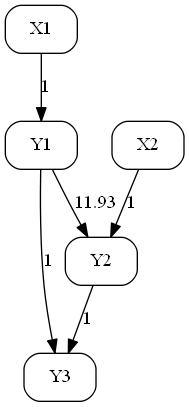 | 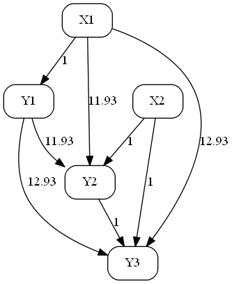 | 
Estimated effects | 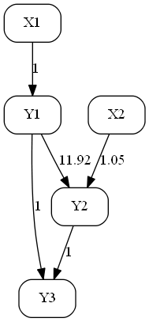 | 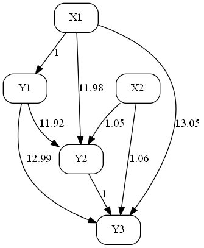 | 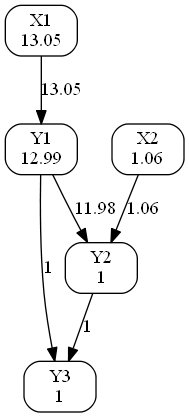
Individual effects for individual no. 1 | 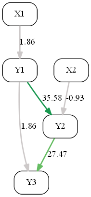 | 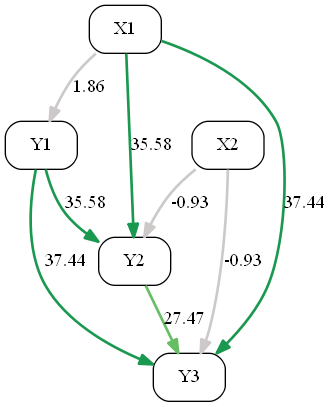 | 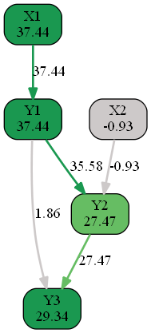

As you can see in the bottom right graph for the individual mediation effects (IME),
there is one green path starting at X<sub>1</sub> passing through Y<sub>1</sub>, Y<sub>2</sub>
and finally ending in Y<sub>3</sub>. This means that X<sub>1</sub> is the main cause for
Y<sub>3</sub> taking on a value above average with its effect being +37.44.
However, this positive effect is slightly reduced by X<sub>2</sub>. In total,
accounting for all exogenous and endogenous effects, Y<sub>3</sub> is +29.34 above average.
It just takes a minute to understand why for individual no. 1 Y<sub>3</sub> is above average.

The t-values corresponding to the estimated effects are also given as graphs.
To asses model validation using the t-value graphs note the following:

- The t-values with respect to zero should be _larger_ than two in absolute value, indicating
that the specified model structure indeed yields significant effects.

- The t-values with respect to the hypothesized model effects should be _smaller_ than two in
absolute value, indicating that there is no severe devation between model and data.

- For the mediation t-value graphs EM0 and EM1 the outgoing edges do not some up to its
outgoing node. In the EM0 graph all outgoing edges are even identical to their outgoing node
because effects and standard deviations are partioned in the same way over their outgoing edges
thus cancelling out in the t-values. However, this is not true for the EM1 graph since
different partitioning schemes are used for the estimated and subtracted hypothesized model
effects.

Effects | Direct | Total | Mediation for Y<sub>3</sub>
--- | --- | --- | ---
t-values wrt. zero | 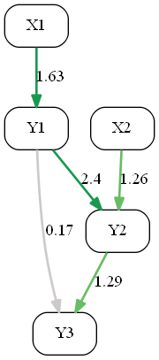 | 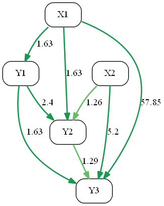 | 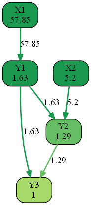
t-values wrt. model | 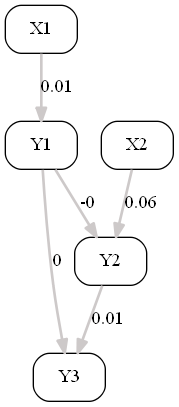 | 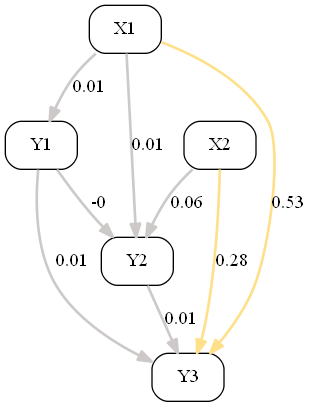 | 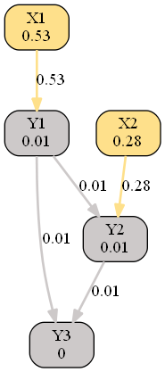

The t-values with respect to zero show that just some of the estimated effects are significant.
This could be due to the small sample size. In this example we estimate five direct effects
from 200 observations with the only observable endogenous variable being Y<sub>3</sub>.

None of the t-values with respect to the hypothesized model values is significant.
This means that the specified model fits well to the observed data.

Biases are estimated for each endogenous variable. Estimation is done at the point of
average effects implied by the specified model. That is, possible model misspecifications
are captured by a single bias, one at at time. Biases therefore are just one simple way
to detect wrong modeling assumptions.

Variable | Bias value | Bias t-value
--- | --- | ---
Y<sub>1</sub> | 0.00 | 0.64
Y<sub>2</sub> | 0.06 | 0.55
Y<sub>3</sub> | 0.06 | 0.55

In our example none of the biases is significant, further supporting correctness of model
specification.

## Start your own Model

When starting _causing.py_ after cloning / downloading the Causing repository you will find
the example results described above in the _output_ folder. They are given as PDF files and
the single graphs are also provided as PNG files for further use.

At the bottom of _causing.py_ the example is called via _model_dat = models.example()_.
To start your own model create a function, e. g. _mymodel_, in module _models_ and generate
the corresponding model data via _model_dat = models.mymodel()_.

You have to provide the following information, as done in the example code below:

- Define all your model variables as SymPy symbols.
- In _define_equations_ define a python function containing the model equations and
returning them in topological
order, that is, in order of computation.
- In _model_dat_, the dictionary to be returned, further specify
    - _xvars_: exogenous variables corresponding to data _xdat_
    - _yvars_: endogenous variables in topological order
    - _ymvars_: set of manifest / observed endogenous variables corresponding to data _ymdat_
    - _final_var_: the final variable of interest used for mediation effects
    - _show_nr_indiv_: to show individual effects only for the first individuals set this
    variable to a value smaller than the sample size, saves computation time
    - _dir_path_: directory path where the output is written to
- load your data _xdat_ and _ymdat_.

In the example case the function looks like this:

```python
def example():
    """model example"""

    X1, X2, Y1, Y2, Y3 = symbols(["X1", "X2", "Y1", "Y2", "Y3"])

    def define_equations(X1, X2):

        eq_Y1 = X1
        eq_Y2 = X2 + 2 * Y1**2
        eq_Y3 = Y1 + Y2

        return eq_Y1, eq_Y2, eq_Y3

    model_dat = {
        "define_equations": define_equations,   # equations in topological order
        "xvars": [X1, X2],                      # exogenous variables corresponding to data
        "yvars": [Y1, Y2, Y3],                  # endogenous variables in topological order
        "ymvars": [Y3],                         # manifest endogenous variables
        "final_var": Y3,                        # final variable of interest, for mediation analysis
        "show_nr_indiv": 3,                     # show first individual effects
        "dir_path": "output/",                  # output directory path
        }

    # load data
    from numpy import loadtxt
    xdat = loadtxt("data/xdat.csv", delimiter=",").reshape(len(model_dat["xvars"]), -1)
    ymdat = loadtxt("data/ymdat.csv", delimiter=",").reshape(len(model_dat["ymvars"]), -1)

    model_dat["xdat"] = xdat                    # exogenous data
    model_dat["ymdat"] = ymdat                  # manifest endogenous data

    return model_dat
```

Start _causing.py_ and view the generated graphs in the _output_ folder.
The file _Causing_Average_and_Estimated_Effects.pdf_ contains the average effects (ADE, ATE, AME)
based on the median _xdat_ observation as well as the estimated effects (EDE, ETE, EME) using
the observed endogenous data _ymdat_.

_Causing_tvalues_and_Biases.pdf_ contains the t-values graphs with respect to zero (ED0, ET0, EM0)
andthe t-values graphs with respect to the hypothesied model (ED1, ET1, EM1).
Also inclused are the estimated biases and their t-values for further model validation.

The enumerated files _Causing_Individual_Effects_\*_.png_ show the individual effects (IDE, ITE, IME)
for the respective individual. In addition to the Individual Mediation Effects (IME)
a table is given, listing the data of the IME nodes in decreasing order.
It helps to identify the variables having the most positive and negative effects on
the final variable for that individual.

## License

Causing is available under MIT license. See [LICENSE](LICENSE.md "LICENSE").

## Consulting

If you need help with your project, don't hesitate to contact me. I could perform the data analytics or adapt the software to your special needs.

Dr. Holger Bartel  
RealRate GmbH  
Cecilienstr. 14, D-12307 Berlin  
[holger.bartel@realrate.de](mailto:holger.bartel@realrate.de?subject=[Causing])  
Phone: +49 160 957 90   
[www.realrate.de](https://www.realrate.de "www.realrate.de")
